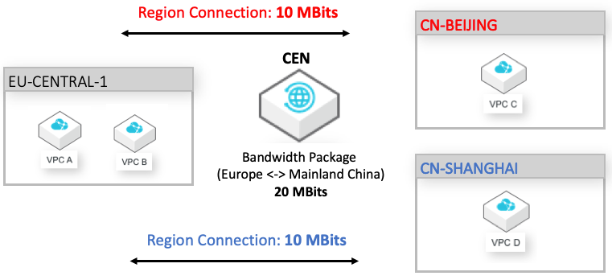
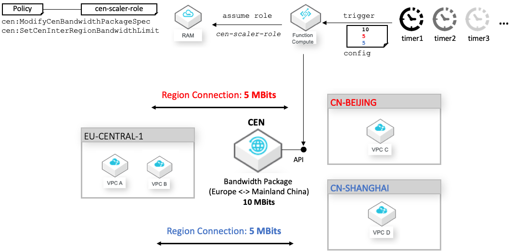

# CEN Scaler
This project helps to automatically scale Cloud Enterprise Network (CEN) bandwidth packages based on different metrics and timing events. It ships together with Alibaba Cloud Function code and Terraform templates that set up all neccessary configurations and services to get you going fast. 

# Structure
CEN Scaler is composed of two different parts: 
- The NodeJS based Alibaba Cloud Function Compute code that is responsible for scaling the bandwidth of your CEN instance at predefined points in time or metric-based alarms. 
- The Terraform scripts that setup everything in your Alibaba Cloud account to make the automatic scaling work. This includes uploading and configuring the Function Compute code and configuring the minimal access rights and permissions for it to change the bandwidth on your behalf.

CEN-Scaler supports two modes: Time-based and Metric-based. The first one changes the bandwidth specifications based on timing events, the latter one reacts to Cloud Monitor Service alarms defined on certain metric thresholds.
You'll find the according scripts and templates in the following directories (where `./src` contains the NodeJS based code and `./terraform`the Terraform scripts):
- Time-based: `./src/time/` and `./terraform/time/`
- Metric-based `./src/metric/` and `./terraform/metric/`

For both time- and metric-based setup the NodeJS Function Compute code is completely generic and does not need to be changed. All configurations and modifications are only to be done in the Terraform scripts.

# Installation
CEN-Scaler uses two different technology stacks: NodeJS for the serverless function code that adjusts the network bandwidth of CEN based on timming or alarm events, and Terraform to set up and configure all needed cloud resources such a Function Compute service, Time-triggers, Cloud Monitor Service alarms, and authorization rules. 
## NPM
In order to install the neccessary dependencies of the Alibaba Cloud Function Compute code you need to have [NPM](https://www.npmjs.com/get-npm) installed on your machine. This repository does not include the depending node modules.
Once installed please run the following command in the `./src/time/` and/or `./src/metric` folder of this project:
`$ npm install`
 
 This will install all neccessary dependencies of the Alibaba Cloud Function Compute project on your local machine into `./src/time/node_modules/` and `./src/metric/node_modules/` respectively. This will be bundled into a zip file later by Terraform and be deployed as Alibaba Cloud Function Compute service.

## Terraform
 HashiCorp Terraform enables you to safely and predictably create, change, and improve infrastructure. It is an open source tool that codifies APIs into declarative configuration files that can be shared amongst team members, treated as code, edited, reviewed, and versioned.
 CEN-Scaler uses Terraform scripts to automatically setup and configure the entire environment in your Alibaba Cloud account. All ressources that CEN-Scaler creates for you do not incur any costs.

 To install Terraform on your machine please refer to [https://www.terraform.io/downloads.html](https://www.terraform.io/downloads.html).

 After you have installed it, please make sure to configure it accordingly with your Alibaba Cloud Access Key and Secret. Make sure that its permission include full access to Function Compute, Cloud Monitor Service, and Resource Access Management (RAM):
```bash
$ export ALICLOUD_ACCESS_KEY=<your_access_key>
$ export ALICLOUD_SECRET_KEY=<your_secret_key>
$ export ALICLOUD_REGION=eu-central-1 (or any other region which supports Function Compute)
```
 
 Then change to the `./terraform/time/` or `./terraform/metric/` directory respectively and run
 ```bash
$ terraform init
$ terraform apply
```
This will configure Terraform accordingly for use with Alibaba Cloud and then execute the scripts. 

## Terraform Scripts - Time
Let's look at how to configure the time-based version of CEN-Scaler.
Before you can actually install CEN Scaler in your account you need to make some configuration changes in the scripts:
* Edit `./terraform/time/variables.tf`: Change the variable `cen_id` to your CEN-Instance ID ([see here](https://github.com/arafato/CEN-Scaler/blob/master/terraform/time/variables.tf#L3)) you want to use
* Edit `./terraform/time/timebased.tf`: Adapt the Alibaba Cloud Function Compute event triggers to your specific needs in terms of number and also time spans ([see here](https://github.com/arafato/CEN-Scaler/blob/master/terraform/timebased.tf)).   

### Example
The default example of this project as configured in `./terraform/time/timebased.tf` defines the following scenario:
* As defined by trigger `triggerscale_1`: Starting every Monday at 6am the CEN bandwidth is upscaled to 20 MBits. This bandwidth is then equally distributed between two region connections (each 10 MBits): `eu-central-1` <-> `cn-bejing`and `eu-central-1` <-> `cn-shanghai`. 
* As defined by trigger `triggerscale_2`: Starting every Saturday at 6am the CEN bandwidth is downscaled to 10 MBits. This bandwidth is then equally distributed between two region connections (each 5 MBits): `eu-central-1` <-> `cn-bejing`and `eu-central-1` <-> `cn-shanghai`.

This example scenario can be adapted to different timespans by changing the value of `cronExpression`. You can use [http://www.cronmaker.com/](http://www.cronmaker.com/) to easily generate cron expressions that fit your requirement. You can also add (or remove) triggers to accomodate for your specific scenario. Same is true for the number of region connections which can be extended or reduced as needed.  

## Terraform Scripts - Metric
Let's look at how to configure the metric-based version of CEN-Scaler.
Before you can actually install CEN Scaler in your account you need to make some configuration changes in the scripts:
* Edit `./terraform/metric/variables.tf`: 
    * Change the variable `cen_id` to your CEN-Instance ID ([see here](https://github.com/arafato/CEN-Scaler/blob/master/terraform/metric/variables.tf#L3)) you want to use
    * Set the shared secret variable ([see here](https://github.com/arafato/CEN-Scaler/blob/master/terraform/metric/variables.tf#L8)) to a secure value. It is shared between the Cloud Monitor alarms and the Function Compute service to restrict access to it since it has a public endpoint

* Edit `./terraform/metric/metricbased.tf`: 
    * Add / Modify the according Cloud Monitor alarms and define your specific traffic thresholds and metric aggregation. Refer to the two pre-defined alarms `"region_up_eu-central-1_cn-hangzhou"` and `"region_down_eu-central-1_cn-hangzhou"` as an example.
    * Add / Modify the `env` variable with the according scaling stragies. A strategy defines the source and target region, and the step. The `step` variable indicates the bandwidth amount in MBit/s on how much to scale up or down the current bandwidth if a certain alarm is triggered. 

To keep the NodeJS code generic, CEN-Scaler expects the following naming conventions when defining the scaling strategies:
The responsible scaling strategy for a particular alarm needs to be named according to the following convention

 `scale_strategy_<TF Resourcename of alarm>` 

So the Terraform resource name of the alarm needs to be prefixed with `"scale_strategy_"`.
# How it works
This section will discuss the design and inner-workings of both CEN-Scaler modes: Time-based and Metric-based.

## Time-based
The example described here is implemented in our [default time template](https://github.com/arafato/CEN-Scaler/blob/master/terraform/time/timebased.tf).
Let's look at below diagram first. This picture shows a typical CEN-based setup.   



VPC A and VPC B are both located in `eu-central-1` (Frankfurt). VPC C is located in `cn-beijing` (Beijing), VPC D is located in `cn-shanghai` (Shanghai). All four VPCs are peered together via a single CEN instance meaning all four VPCs can communicate with each other. The CEN-Instance has an assiged bandwidth package of 20 MBits. This bandwidth is equally distributed (2x 10 MBits) across two region connections: Frankfurt-Beijing and Frankfurt-Shanghai. Communication is between the various VPCs is routed over Alibaba Cloud's private global backbone network.

Bandwidth packages can be freely up- and down-scaled to optimize on costs. So during times where less bandwith is needed (e.g. during weekends), bandwidth can be scaled down to lower values, e.g. 10 MBits. In this case, also the according region connection values need to be updated. Since we distribute the bandwidth equally, we need to set the values to 5 MBits each. During workdays we upscale bandwidth again to 20 Mbits (und also update the region connection values). 
CEN Scaler helps you to easily configure and automate such tasks. Below figure depicts how CEN Scaler works: 



It automatically creates an event-triggered Function Compute that adapts the bandwidth and region connection values according to your configuration. You are free to define as many triggers and different configurations you need to accomodate for your requirements and cost optimizations. CEN Scaler will also setup the neccessary RAM service role and minimum permissions needed to scale the CEN bandwidth. Function Compute will then assume this role and use a temporary token issued by Alibaba Cloud Secure Token Service (STS) to authorize itself against the CEN API when it is triggered. Along with the event trigger the according bandwidth configuration will be passed to the Function Compute instance which it uses to parametrize the call accordingly. 

## Metric-based
The example described here is implemented in our [default metric template](https://github.com/arafato/CEN-Scaler/blob/master/terraform/metric/metricbased.tf). Let's again look at the typcial CEN-based setup as discussed in previous section.  This time we focus on dynamically scaling the region bandwidth between `eu-central-1`(Frankfurt) and `cn-beijing` based on the current network utilization.

We want to automatically upscale the current region bandwidth by 1 MBit/s if the every minute average utilization of the current region bandwidth was above 90% for the last 2 minutes. Likewise we would like to downscale the current bandwidth by 1 Mbit/s if the average utilization was below 60% for the last 3 minutes.
No matter if we up- or downscale, we also need to adjust the current bandwidth package accordingly that is attached to the CEN instance.


# Roadmap
- We are currently working on supporting Cloud Monitor events and alarms to trigger scaling actions. This will allows for metric-based scaling rules for CEN.

# Contributions
## What do I need to know to help?
If you are interested in making a code contribution and would like to learn more about the technologies that we use, check out the list below.

- Alibaba Cloud
- Alibaba Cloud Function Compute
- Terraform 

## How do I make a contribution?

Never made an open source contribution before? Wondering how contributions work in CEN-Scaler? Here's a quick rundown!

1. Find an issue that you are interested in addressing or a feature that you would like to add.

2. Fork the Azurite repository to your local GitHub organization. This means that you will have a copy of the repository under `your-GitHub-username/CEN-Scaler`.

3. Clone the repository to your local machine using git clone `https://github.com/github-username/cen-scaler.git`.

4. Create a new branch for your fix using `git checkout -b branch-name-here`.
Make the appropriate changes for the issue you are trying to address or the feature that you want to add.

5. Use `git add insert-paths-of-changed-files-here` to add the file contents of the changed files to the "snapshot" git uses to manage the state of the project, also known as the index.

6. Use `git commit -m "Insert a short message of the changes made here"` to store the contents of the index with a descriptive message.

7. Push the changes to the remote repository using `git push origin branch-name-here`.

8. Submit a pull request to the upstream repository.
Title the pull request with a short description of the changes made and the issue or bug number associated with your change. For example, you can title an issue like so "Added more log outputting to resolve #4352".
In the description of the pull request, explain the changes that you made, any issues you think exist with the pull request you made, and any questions you have for the maintainer. It's OK if your pull request is not perfect (no pull request is), the reviewer will be able to help you fix any problems and improve it!

9. Wait for the pull request to be reviewed by a maintainer.
Make changes to the pull request if the reviewing maintainer recommends them.

10. Celebrate your success after your pull request is merged!

## Where can I go for help?
If you need help, you can ask questions directly at our [issues site on Github](https://github.com/arafato/cen-scaler/issues).

